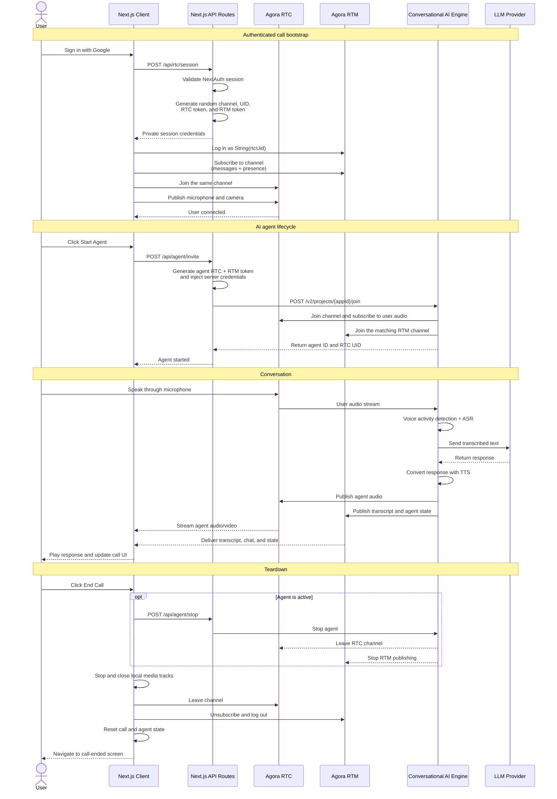

# My Agora AI App

A private one-user, one-agent video call built with Next.js 15, React 19, Agora RTC/RTM, and Agora Conversational AI.

After Google authentication, the app creates a random Agora channel and joins it immediately. A protected Next.js route generates short-lived RTC and RTM tokens locally with `agora-token`; the App Certificate never reaches the browser. The call retains live transcript/chat, optional AI avatars, and the full agent configuration experience.

## Call flow



Each bootstrap, refresh, retry, or `Start new call` action creates a new unguessable channel. Shareable call links and human-to-human room joining are intentionally unsupported.

## Features

- Google authentication with direct launch into `/call`
- Locally generated RTC and RTM tokens with a shared numeric/string identity
- Microphone and camera toggles with explicit hardware release
- Start/stop Conversational AI agent
- Full agent settings, LLM/TTS/ASR providers, MCP tools, and optional avatars
- RTM live transcript and text/image chat
- Fifteen-minute call limit followed by a protected call-ended screen
- Responsive user/agent tiles and a mobile transcript drawer

The call control bar contains only microphone, camera, end call, start/stop agent, and agent settings.

## Requirements

- Node.js 18+
- A Google OAuth web application
- An Agora project with an App ID and App Certificate
- Agora RTM and Conversational AI enabled
- Agora Customer ID and Customer Secret for Conversational AI REST authentication
- Credentials for whichever agent providers you enable

Configure the Google callback URL as:

```text
http://localhost:3000/api/auth/callback/google
```

Use the equivalent HTTPS URL in production.

## Setup

```bash
npm install
cp .env.example .env
npm run dev
```

Required core variables:

```env
AUTH_SECRET=""
GOOGLE_CLIENT_ID=""
GOOGLE_CLIENT_SECRET=""

NEXT_PUBLIC_AGORA_APP_ID=""
AGORA_APP_CERTIFICATE=""
AGORA_CUSTOMER_ID=""
AGORA_CUSTOMER_SECRET=""
```

`AGORA_APP_CERTIFICATE`, `AGORA_CUSTOMER_ID`, `AGORA_CUSTOMER_SECRET`, and all provider API keys are server-only. Never add a `NEXT_PUBLIC_` prefix to them.

See [.env.example](.env.example) for optional provider and avatar settings.

## Server routes

| Route | Purpose |
| --- | --- |
| `POST /api/rtc/session` | Authenticated RTC/RTM session generation; returns `Cache-Control: no-store` |
| `/api/agent/*` | Authenticated Conversational AI lifecycle proxy |
| `/api/upload/*` | Temporary image support for agent chat |

The session route accepts no client channel, UID, or identity. It derives the display name from NextAuth and returns a random channel plus one RTC/RTM identity pair.

## Commands

```bash
npm run dev
npm test
npm run lint
npm run build
```

Tests cover token/session generation, authentication behavior, Strict Mode bootstrap, RTC/RTM identity alignment, partial cleanup, state reset, the five-control UI, and call-ended actions.
