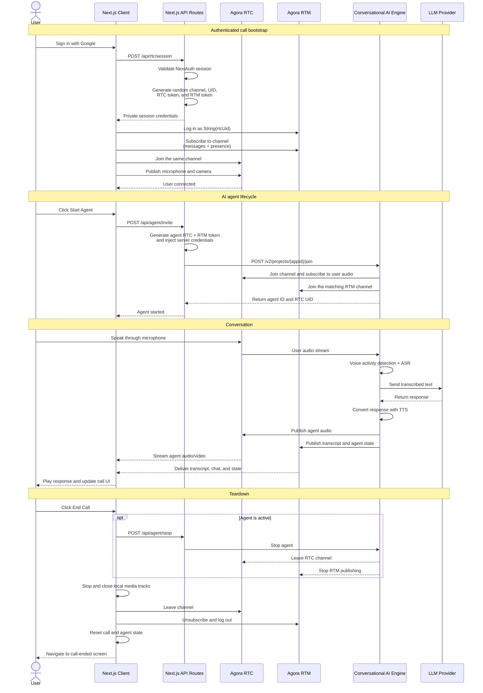

# My Agora AI App

A private one-user, one-agent video call built with Next.js 15, React 19, Agora RTC/RTM, and Agora Conversational AI.

After Google authentication, the app creates a random Agora channel and joins it immediately. A protected Next.js route generates short-lived RTC and RTM tokens locally with `agora-token`; the App Certificate never reaches the browser. The call retains live transcript/chat, optional AI avatars, and the full agent configuration experience.

## Call flow



Each bootstrap, refresh, retry, or `Start new call` action creates a new unguessable channel. Shareable call links and human-to-human room joining are intentionally unsupported.

## Features

- Google authentication with direct launch into `/call`
- Locally generated RTC and RTM tokens with a shared numeric/string identity
- Microphone and camera toggles with explicit hardware release
- Start/stop Conversational AI agent
- Full agent settings, LLM/TTS/ASR providers, MCP tools, and optional avatars
- Authenticated outbound PSTN calls using a phone number imported into Agora Console
- Live outbound-call status, post-call transcript, structured output, and recording playback
- RTM live transcript and text/image chat
- Fifteen-minute call limit followed by a protected call-ended screen
- Responsive user/agent tiles and a mobile transcript drawer

The call control bar contains only microphone, camera, end call, start/stop agent, and agent settings.

## Requirements

- Node.js 18+
- A Google OAuth web application
- An Agora project with an App ID and App Certificate
- Agora RTM and Conversational AI enabled
- Agora Customer ID and Customer Secret for Conversational AI REST authentication
- Credentials for whichever agent providers you enable

Configure the Google callback URL as:

```text
http://localhost:3000/api/auth/callback/google
```

Use the equivalent HTTPS URL in production.

## Setup

```bash
npm install
cp .env.example .env
npm run dev
```

Required core variables:

```env
AUTH_SECRET=""
GOOGLE_CLIENT_ID=""
GOOGLE_CLIENT_SECRET=""

NEXT_PUBLIC_AGORA_APP_ID=""
AGORA_APP_CERTIFICATE=""
AGORA_CUSTOMER_ID=""
AGORA_CUSTOMER_SECRET=""
```

`AGORA_APP_CERTIFICATE`, `AGORA_CUSTOMER_ID`, `AGORA_CUSTOMER_SECRET`, and all provider API keys are server-only. Never add a `NEXT_PUBLIC_` prefix to them.

See [.env.example](.env.example) for optional provider and avatar settings.

## Outbound telephony

> **API availability:** This integration uses the Agent Studio V2 telephony
> gateway observed in the working Agora Console/Agent Studio flow. These
> endpoints are not currently documented as a public Agora API and may require
> project provisioning or change without the compatibility guarantees of a
> public API. Confirm production access and support expectations with Agora.

The playground can place a direct outbound PSTN call without a published Studio
pipeline ID. It sends the agent's current ASR, LLM, TTS, turn-detection, and MCP
configuration with each call. Agora resolves the PSTN/SIP routing from the
phone-number record configured in Agora Console.

### Prerequisites

1. Use an Agora project that has access to Agent Studio telephony.
2. In Agora Console/Agent Studio, open **Telephony → Phone Numbers** and import
   the caller number.
3. Configure that number's SIP trunk using your telephony provider. The current
   setup uses Vobiz; Twilio or another compatible SIP provider can be used. SIP
   address, transport, username, password, and inbound routing belong in the
   Agora Console configuration, not in this application's environment.
4. Note the imported record's numeric `id` (the phone-number ID). This is not
   the E.164 number and not a Studio pipeline ID.

You can retrieve phone-number records with the provisioned gateway:

```http
GET {AGENT_STUDIO_V2_BASE_URL}/v2/phone-numbers?page=1&page_size=100
Authorization: Basic {base64(AGORA_CUSTOMER_ID:AGORA_CUSTOMER_SECRET)}
```

Find the item for your imported E.164 number and use its `id` as
`AGORA_TELEPHONY_PHONE_NUMBER_ID`.

### Server configuration

```env
# Agent Studio V2 gateway supplied/provisioned by Agora. Do not append /v2.
AGENT_STUDIO_V2_BASE_URL="https://api.agora.io/conversational-ai"

# Numeric id returned by GET /v2/phone-numbers; not the phone number itself.
AGORA_TELEPHONY_PHONE_NUMBER_ID=""

# Public Agora App ID plus server-only REST credentials.
NEXT_PUBLIC_AGORA_APP_ID=""
AGORA_CUSTOMER_ID=""
AGORA_CUSTOMER_SECRET=""
```

The server constructs HTTP Basic authentication as:

```text
Authorization: Basic base64(<AGORA_CUSTOMER_ID>:<AGORA_CUSTOMER_SECRET>)
```

Never put the Customer ID, Customer Secret, provider credentials, or generated
Basic Auth value in browser code or a `NEXT_PUBLIC_` variable. The playground's
authenticated Next.js routes add this header server-side and mask credentials
in diagnostic logs.

### Start an outbound call

The server calls:

```http
POST {AGENT_STUDIO_V2_BASE_URL}/v2/outbound-dial/{NEXT_PUBLIC_AGORA_APP_ID}
Content-Type: application/json
Authorization: Basic {base64(AGORA_CUSTOMER_ID:AGORA_CUSTOMER_SECRET)}
```

Request shape:

```json
{
  "phone_num_id": 123,
  "to_number": "+15551234567",
  "call_id": "<generated-uuid>",
  "max_duration_seconds": 300,
  "max_silence_duration_ms": 60000,
  "max_ring_duration_ms": 30000,
  "idle_timeout": 120,
  "enable_recording": true,
  "properties": {
    "advanced_features": {
      "enable_rtm": true,
      "enable_tools": true
    },
    "parameters": {
      "data_channel": "rtm"
    },
    "llm": { "...": "current LLM settings and server-injected credentials" },
    "tts": { "...": "current TTS settings and server-injected credentials" },
    "asr": { "...": "current ASR settings and server-injected credentials" }
  }
}
```

`to_number` must use E.164 format. `properties` is built from the current Agent
Settings UI and intentionally excludes web-call runtime fields such as
`channel`, `token`, `agent_rtc_uid`, and `remote_rtc_uids`; the telephony service
creates that runtime. A Studio pipeline ID is therefore optional for this flow.

### Status, transcript, and recording

After dialing, the playground polls:

```http
GET {AGENT_STUDIO_V2_BASE_URL}/v2/calls/{call_id}?source_system=external
Authorization: Basic {base64(AGORA_CUSTOMER_ID:AGORA_CUSTOMER_SECRET)}
```

The call-detail response can provide `answered_ts`, `end_ts`,
`duration_seconds`, `from_number`, `to_number`, `call_category`,
`hangup_reason`, `transcript`, `structured_output`, and `record_file_url`.
The UI maps those fields to dialing/live/completed/failed state and continues
polling briefly after completion while transcript and recording artifacts are
processed.

Recording URLs are refreshed and streamed through an authenticated application
route rather than exposed directly. The proxy supports byte ranges for inline
audio playback and can return the same file as a download.

### Application routes

| Route | Purpose |
| --- | --- |
| `GET /api/telephony/config` | Reports whether server telephony is configured and exposes only the non-secret phone-number ID |
| `POST /api/telephony/outbound` | Validates the destination/options, injects provider credentials, and starts the outbound call |
| `GET /api/telephony/calls/{callId}` | Proxies call status, duration, outcome, transcript, structured output, and recording readiness |
| `GET /api/telephony/calls/{callId}/recording` | Authenticated recording download |
| `GET /api/telephony/calls/{callId}/recording?disposition=inline` | Authenticated inline playback with byte-range support |

## Server routes

| Route | Purpose |
| --- | --- |
| `POST /api/rtc/session` | Authenticated RTC/RTM session generation; returns `Cache-Control: no-store` |
| `/api/agent/*` | Authenticated Conversational AI lifecycle proxy |
| `/api/telephony/*` | Authenticated outbound PSTN calling, status, transcript, and recording proxy |
| `/api/upload/*` | Temporary image support for agent chat |

The session route accepts no client channel, UID, or identity. It derives the display name from NextAuth and returns a random channel plus one RTC/RTM identity pair.

## Commands

```bash
npm run dev
npm test
npm run lint
npm run build
```

Tests cover token/session generation, authentication behavior, Strict Mode bootstrap, RTC/RTM identity alignment, partial cleanup, state reset, the five-control UI, call-ended actions, outbound telephony payload/auth handling, status polling, transcript rendering, and recording streaming.
